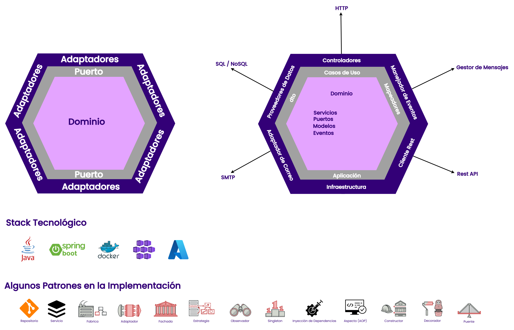
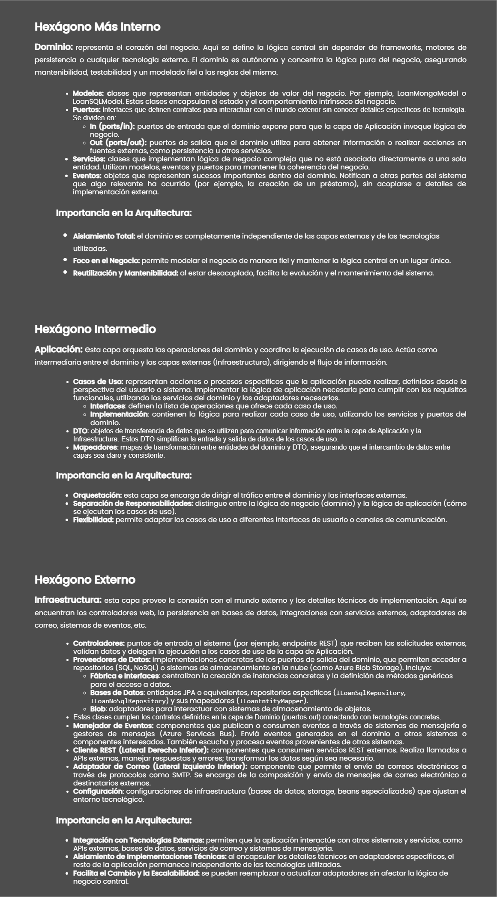

| Fecha | Descripción | Realizado por | Validado por | Fecha de Validación |
|:-:|:-:|:-:|:-:|:-:|
| 25/11/2024 | Creación del Documento | Jairo Andrés Duarte Guzmán |**|**|

# Arquetipo

## 1. Arquitectura Hexagonal

La Arquitectura Hexagonal (también conocida como Arquitectura de Puertos y Adaptadores) es un patrón arquitectónico que promueve la separación de preocupaciones al dividir la aplicación en capas o componentes independientes. El núcleo de la aplicación (dominio) está aislado de los detalles de infraestructura y tecnología, permitiendo que los componentes externos interactúen con el núcleo a través de puertos (interfaces) y adaptadores (implementaciones concretas).

* **Aplicación en el Arquetipo:**
    * **Dominio (domain):** contiene la lógica de negocio pura, incluyendo entidades, servicios de dominio y repositorios (interfaces).
    * **Aplicación (application):** orquesta los casos de uso y actúa como intermediario entre el dominio y el mundo exterior.
    * **Infraestructura (infrastructure):** implementa los detalles técnicos y de infraestructura, como controladores, repositorios concretos, adaptadores y configuraciones.



## 2. Estructura del Proyecto

```scss
src
└── main
    └── java
        └── com
            └── tuempresa
                └── operationsandexecution
                    ├── BankingApplication.java
                    ├── loansanddeposits
                    │   ├── application
                    │   │   ├── usecases
                    │   │   │   └── loan
                    │   │   │   │   └── implementation
                    │   │   │   │       └── CreateLoan.java
                    │	│   │   │       └── GetLoanById.java
                    │   │   │   │   └── interfaces
                    │   │   │   │       └── ICreateLoan.java
                    │   │   │   │       └── IGetLoanById.java					
                    │   │   └── dto
                    │   │   │   └── LoanDto.java
                    │   │   └── mappers
                    │   │       └── ILoanDtoMapper.java
                    │   ├── domain
                    │   │   ├── models
                    │   │   │   └── LoanMongoModel.java
                    │   │   │   └── LoanSQLModel.java
                    │   │   ├── events
                    │   │   ├── ports
                    │   │   │	└── in
                    │   │   │   │   └── ILoanNoSqlServicePort.java
                    │   │   │   │   └── ILoanSqlServicePort.java
                    │   │   │	└── out
                    │   │   │   │   └── ILoanNoSqlPersistencePort.java
                    │   │   │   │   └── ILoanSqlPersistencePort.java
                    │   │   │   │   └── IStoragePort.java
                    │   │   └── services
                    │   │   │   └── LoanNoSqlService.java
                    │   │   │   └── LoanSqlService.java
                    │   ├── infrastructure
                    │   │   ├── configuration
                    │   │   │   ├── BlobStorageConfiguration.java
                    │   │   │   ├── DataSourceConfiguration.java
                    │   │   │   └── RepositoryConfiguration.java
                    │   │   ├── controllers
                    │   │   │   └── LoanControllers.java
                    │   │   ├── dataproviders
                    │   │   │   ├── DataProviderFactory.java
                    │   │   │   ├── IDataProvider.java
                    │   │   │   └── blob
                    │   │   │       └── StorageDataProvider.java
                    │   │   │   └── database
                    │   │   │   │   └── entitymanagers
                    │   │   │   │       └── entities
                    │   │   │   │           ├── LoanNoSqlEntity.java
                    │   │   │   │           └── LoanSqlEntity.java
                    │   │   │   │       └── interfaces
                    │   │   │   │           ├── ILoanNoSqlRepository.java
                    │   │   │   │           └── ILoanSqlRepository.java
                    │   │   │   └── implementation
                    │   │   │   │   └── DataProviderFactory.java
                    │   │   │   │   └── GenericRepository.java
                    │   │   │   │   └── LoanNoSqlPersistence.java
                    │   │   │   │   └── LoanSqlPersistence.java
                    │   │   │   │   └── NoSqlDataProvider.java
                    │   │   │   │   └── SqlDataProvider.java
                    │   │   │   └── interfaces
                    │   │   │   │   └── IDataProvider.java
                    │   │   │   │   └── IGenericRepository.java
                    │   │   │   │   └── INoSqlDataProvider.java
                    │   │   │   │   └── ISqlDataProvider.java
                    │   │   │   └── mappers
                    │   │   │   │   └── ILoanEntityMapper.java
                    │   │   ├── emailadapters
                    │   │   ├── eventhandlers
                    │   │   └── restclients
                    ├── crosscutting
                    │   ├── messages
                    │   │   ├── IMessageService.java
                    │   │   ├── Message.java
                    │   │   ├── MessageService.java
                    │   │   └── MessageType.java
                    │   ├── exceptions
                    │   │   ├── ApiErrorResponse.java
                    │   │   ├── ApiException.java
                    │   │   ├── ApiResponseDto.java
                    │   │   └── GlobalExceptionHandler.java
                    │   │   └── ResponseFactory.java
                    │   │   └── StorageException.java
                    │   └── aspects
                    │   │   ├── LoggingAspect.java
                    │   │   └── ExceptionHandlingAspect.java
                    │   ├── configuration
                    │   │   ├── GlobalConfiguration.java
                    │   │   ├── SecretConfiguration.java
                    │   │   ├── SwaggerConfig.java
                    │   └── logging
                    │   │   ├── ILoggerService.java
                    │   │   └── LoggerService.java
                    │   └── secrets
                    │   │   ├── SecretService.java
                    │   │   └── ISecretService.java
                    │   └── constants
                    │   │   └── application
                    │   │   │   └── ApplicationContants.java
                    │   │   └── common
                    │   │   │   └── AspectsConstants.java
                    │   │   │   └── CommonConstants.java
                    │   │   │   └── ExceptionsConstants.java
                    │   │   │   └── MessagesConstants.java
                    │   │   │   └── SwaggerConstants.java
                    │   │   └── domain
                    │   │   │   └── DomainConstants.java
                    │   │   └── infrastructure
                    │   │   │   └── InfrastructureConstants.java
                    │   └── documentation
                    │   │   ├── ApiResponsesExamples.java
                    │   │   ├── CommonApiResponses.java
                    │   │   ├── JsonResponseTemplates.java
```
## 3. Homologación Arquitectura Hexagonal a BIAN


## 4. Patrones de Diseño Implementados

### 4.1. Patrón Repositorio (Repository Pattern)

El Patrón Repositorio abstrae el acceso a los datos, permitiendo a la aplicación interactuar con las fuentes de datos de una manera consistente e independiente de la implementación concreta (base de datos SQL, NoSQL, archivos, etc.).

* **Aplicación en el Arquetipo:**
    * **Interfaces de Repositorio en el Dominio:**
        **`IGenericRepository.java`**
        **`IStorageService.java`**

    * **Implementaciones en Infraestructura:**
        **`GenericRepository.java`** implementación genérica para repositorios.
        **`LoanSqlRepository.java`** y **`LoanNoSqlRepository.java`** implementaciones específicas para SQL y NoSQL.
        **`StorageService.java`** en **`dataproviders/blob`** implementación del servicio de almacenamiento.

* **Cómo se Aplica:**
    * Los servicios de dominio utilizan las interfaces de repositorio para acceder a los datos, sin conocer los detalles de cómo se almacenan o recuperan.
    * Las implementaciones concretas de los repositorios se ubican en la capa de infraestructura, permitiendo cambiar o agregar nuevas fuentes de datos sin afectar al dominio.

### 4.2. Patrón Servicio (Service Layer Pattern)

El Patrón Servicio define una capa de servicios que encapsula la lógica de negocio y coordina las operaciones de los repositorios y otras entidades del dominio.

* **Aplicación en el Arquetipo:**
    * **Servicios de Dominio:**
        **`LoanService.java`** en **`domain/services`**

    * **Casos de Uso en la Capa de Aplicación:**
        **`CreateLoan.java`**
        **`GetLoanById.java`**

* **Cómo se Aplica:**
    * Los casos de uso (**`usecases`**) utilizan los servicios de dominio para ejecutar operaciones de negocio específicas.
    * Los servicios de dominio encapsulan la lógica de negocio, manteniendo el dominio coherente y evitando que los controladores o casos de uso tengan lógica de negocio.

### 4.3. Patrón de Fábrica (Factory Pattern)

El Patrón de Fábrica proporciona una forma de crear objetos sin exponer la lógica de creación al cliente, y se utiliza para encapsular la creación de objetos.

* **Aplicación en el Arquetipo:**
    * **Clase **`DataProviderFactory.java`** en **`infrastructure/dataproviders`**:**
        * Esta clase es responsable de crear instancias de los proveedores de datos (por ejemplo, SQL, NoSQL, Blob Storage) según sea necesario.

* **Cómo se Aplica:**
    * La fábrica decide qué implementación de **`IDataProvider`** o **`Repository`** utilizar en tiempo de ejecución, ocultando los detalles de creación al resto de la aplicación.
    * Facilita la inyección de dependencias y el cambio de implementaciones sin modificar el código cliente.

### 4.4. Patrón Adaptador (Adapter Pattern)

El Patrón Adaptador permite que clases con interfaces incompatibles trabajen juntas, convirtiendo la interfaz de una clase en otra que el cliente espera.

* **Aplicación en el Arquetipo:**
    * **Adaptadores en **`infrastructure/dataproviders`**:**
        * Blob Storage Adapter:
            **`StorageService.java`** implementa **`IStorageService`**
        * Proveedores de Datos:
            **`NoSqlDataProvider.java`** implementa **`INoSqlDataProvider`**
            **`SqlDataProvider.java`** implementa **`ISqlDataProvider`**

    * **Email Adapters:**
        * **`emailadapters`** actualmente no se han creado las clases, actua como adaptador para servicios de correo electrónico.

* **Cómo se Aplica:**
    * Los adaptadores implementan las interfaces esperadas por el dominio o la aplicación y traducen las llamadas a las implementaciones concretas.
    * Permiten que el dominio y la aplicación no dependan de detalles específicos de infraestructura o servicios externos.

### 4.5. Patrón Fachada (Facade Pattern)

El Patrón Fachada proporciona una interfaz simplificada a un conjunto de interfaces en un subsistema, haciendo que el subsistema sea más fácil de usar.

* **Aplicación en el Arquetipo:**
    * **Servicios de Dominio como Fachadas:**
        * **`LoanService.java`** actúa como una fachada que encapsula las operaciones relacionadas con préstamos, proporcionando métodos sencillos al resto de la aplicación.

* **Cómo se Aplica:**
    * Los servicios de dominio ofrecen una interfaz clara y simplificada para operaciones complejas que pueden involucrar múltiples repositorios, entidades y lógica de negocio.
    * Facilitan la interacción con el dominio desde los casos de uso y controladores.

### 4.6. Patrón Estrategia (Strategy Pattern)

El Patrón Estrategia permite definir una familia de algoritmos, encapsular cada uno y hacerlos intercambiables. Permite que el algoritmo varíe independientemente de los clientes que lo utilizan.

* **Aplicación en el Arquetipo:**
    * **Múltiples Implementaciones de Proveedores de Datos:**
        * Interfaces como **`IDataProvider`**, **`INoSqlDataProvider`**, **`ISqlDataProvider`** y sus implementaciones correspondientes (**`NoSqlDataProvider.java`**, **`SqlDataProvider.java`**).

* **Cómo se Aplica:**
    * La aplicación puede elegir dinámicamente qué estrategia (proveedor de datos) utilizar en tiempo de ejecución, permitiendo cambiar entre diferentes formas de acceso a datos sin modificar el código cliente.
    * Facilita la extensión de nuevas estrategias de almacenamiento o acceso a datos en el futuro.

### 4.7. Patrón Observador (Observer Pattern)

El Patrón Observador define una dependencia uno a muchos entre objetos, de manera que cuando un objeto cambia de estado, todos sus dependientes son notificados y actualizados automáticamente.

* **Aplicación en el Arquetipo:**
    * **Manejo de Eventos:**
        * Eventos y Manejadores en **`domain/events`** y **`infrastructure/eventhandlers`**:
            * Actualmente no se han creado las clases, los directorios **`events`** y **`eventhandlers`** lo ideal es el uso eventos y suscriptores.

* **Cómo se Aplica:**
    * Cuando ocurre un evento en el dominio (por ejemplo, la creación de un préstamo), se puede notificar a múltiples manejadores que realizan acciones adicionales (enviar correos electrónicos, actualizar estadísticas, entre otros.).
    * Desacopla el origen del evento de los efectos secundarios, mejorando la modularidad y extensibilidad.

### 4.8. Patrón Singleton

El Patrón Singleton asegura que una clase tenga solo una instancia y proporciona un punto de acceso global a ella.

* **Aplicación en el Arquetipo:**
    * **Servicios de Configuración y Manejo de Secretos:**
        * **`SecretService.java`** esta implementado como un singleton para asegurar un único punto de acceso a los secretos de la aplicación.

* **Cómo se Aplica:**
    * Garantiza que componentes críticos como la configuración de secretos o ciertos servicios compartidos tengan una única instancia en toda la aplicación.
    * Controla el acceso y gestión de recursos compartidos.

### 4.9. Patrón Inyección de Dependencias (Dependency Injection)

La Inyección de Dependencias es un patrón donde las dependencias (servicios, repositorios, etc.) son proporcionadas a una clase en lugar de ser creadas por ella misma. Promueve la modularidad y facilita las pruebas.

* **Aplicación en el Arquetipo:**
    * **Uso de Anotaciones como **`@Autowired:`****
        * Inyección de servicios y repositorios en controladores y casos de uso.
    * **Configuraciones en **`infrastructure/configuration`**:**
        * Clases como **`RepositoryConfig.java`** y **`DataSourceConfig.java`** definen cómo se configuran e inyectan las dependencias.

* **Cómo se Aplica:**
    * Las clases no crean sus propias dependencias, sino que las reciben a través del constructor o propiedades, facilitando la inversión de control.
    * Mejora la testeabilidad al permitir inyectar implementaciones simuladas o mock durante las pruebas.

### 4.10. Patrón Aspecto (Aspect-Oriented Programming - AOP)

La Programación Orientada a Aspectos permite separar las preocupaciones transversales (como logging, manejo de excepciones, seguridad, entre otros) del código de negocio principal mediante la definición de aspectos.

* **Aplicación en el Arquetipo:**
    * **Aspects en **`crosscutting/aspects`**:**
        * **`LoggingAspect.java`**
        * **`ExceptionHandlingAspect.java`**

* **Cómo se Aplica:**
    * Los aspectos interceptan llamadas a métodos y añaden funcionalidad adicional sin modificar el código original.
    * Facilitan la implementación de funcionalidades transversales de manera centralizada y reutilizable.

### 4.11. Patrón Builder (Constructor)

El Patrón Builder separa la construcción de un objeto complejo de su representación, permitiendo que el mismo proceso de construcción pueda crear diferentes representaciones.

* **Aplicación en el Arquetipo:**
    * **Construcción de Objetos DTO o Entidades:**
        * Se esta utilizando builders para crear instancias de **`LoanDTO`** o **`LoanSQLEntity`** con un enfoque más legible y mantenible.

* **Cómo se Aplica:**
    * Facilita la creación de objetos con múltiples propiedades, especialmente cuando algunas son opcionales o requieren validación.
    * Mejora la legibilidad y evita constructores con muchos parámetros.

### 4.12. Patrón Decorador (Decorator Pattern)

El Patrón Decorador permite agregar dinámicamente responsabilidades adicionales a un objeto.

* **Aplicación en el Arquetipo:**
    * **Servicios de Mensajes y Logging:**
        * Se esta decorando servicios para añadir funcionalidades adicionales como **`logging`** o **`manejo de errores`**.

* **Cómo se Aplica:**
    * Extiende la funcionalidad de los servicios sin modificar su código original.
    * Permite agregar características de manera flexible y modular.

### 4.13. Patrón Puente (Bridge Pattern)

El Patrón Puente desacopla una abstracción de su implementación para que ambas puedan variar independientemente.

* **Aplicación en el Arquetipo:**
    * **Interfaces y Implementaciones Separadas:**
        * Separación de interfaces como **`ILoggerService`** y sus implementaciones en **`LoggerService.java`**.
        * Esto permite cambiar la implementación del logger sin afectar al código que lo utiliza.

* **Cómo se Aplica:**
    * Permite que la abstracción y la implementación evolucionen de manera independiente.
    * Facilita la extensión y modificación de implementaciones sin cambiar las abstracciones.

### 4.14. Aplicación de los Principios SOLID

Además de los patrones de diseño, se esta aplicando los principios **`SOLID`**:

* **Single Responsibility Principle (SRP):**
    * Cada clase tiene una única responsabilidad, como **`LoanService`** que maneja la lógica de préstamos.

* **Open/Closed Principle (OCP):**
    * Las clases están abiertas para extensión pero cerradas para modificación, permitiendo agregar nuevas funcionalidades sin cambiar el código existente.

* **Liskov Substitution Principle (LSP):**
    * Las clases derivadas pueden sustituir a sus clases base sin alterar el correcto funcionamiento de la aplicación.

* **Interface Segregation Principle (ISP):**
    * Se crean interfaces específicas y pequeñas, evitando depender de métodos que no se utilizan.

* **Dependency Inversion Principle (DIP):**
    * Se depende de abstracciones (**`interfaces`**) en lugar de implementaciones concretas, facilitando el cambio de implementaciones sin afectar al código que las utiliza.

## 5. Guía de Arquitectura Hexagonal para Desarrolladores

Esta guía proporciona una descripción detallada de la Arquitectura Hexagonal implementada en el arquetipo. Su objetivo es ayudar a los desarrolladores a familiarizarse con las diferentes capas y componentes, explicando su función y cómo interactúan entre sí. Se incluyen referencias a clases y archivos específicos para facilitar la comprensión y navegación del código.



### 5.1. Capas de la Arquitectura

A continuación, se describen las diferentes capas de la arquitectura, su propósito y las principales clases que las componen, ajustando la documentación a la nueva estructura propuesta. Cada capa se apoya en las demás de forma clara, manteniendo la lógica de negocio aislada de los detalles técnicos y ofreciendo flexibilidad y mantenibilidad.

#### 5.1.1. Capa de Dominio

**Propósito:** contiene la lógica de negocio pura y las reglas que gobiernan el comportamiento de la aplicación. Esta capa es independiente de frameworks y detalles de implementación externos. Aquí se modelan las entidades de negocio (ahora llamadas **modelos**), eventos y puertos que permiten una interacción desacoplada con la infraestructura.

**Ubicación:** **`com.pragma.operationsandexecution.loansanddeposits.domain`**

**Componentes Principales:**
* **Modelos (**`models`**):**
    * **`LoanSQLModel.java`** y **`LoanMongoModel.java`**
        * Representan el modelo de negocio **`Préstamo`** con sus propiedades y comportamientos.
        * Se definen atributos como el ID del préstamo, monto, tasa de interés y fechas de inicio y fin.
        * **Ejemplo de Implementación en el Arquetipo:**
            ```java
            {
                @Id
                private String loanId;
                private Double amount;
                private Double interestRate;
                private LocalDate startDate;
                private LocalDate endDate;
            }
            ```
            > **Nota:** para más detalle visitar en el arquetipo la implementación de esta clase en la siguiente ruta: **`src\main\java\com\pragma\operationsandexecution\loansanddeposits\domain\models\LoanSQLModel.java`**, **`src\main\java\com\pragma\operationsandexecution\loansanddeposits\domain\models\LoanMongoModel.java`**
        * **Ejemplo de Uso:**
            ```java
            {
                LoanSQLEntity loanSQLEntity = new LoanSQLEntity();
                loanSQLEntity.setLoanId(loanDTO.getLoanId());
                loanSQLEntity.setAmount(loanDTO.getAmount());
                loanSQLEntity.setInterestRate(loanDTO.getInterestRate());
                loanSQLEntity.setStartDate(loanDTO.getStartDate());
                loanSQLEntity.setEndDate(loanDTO.getEndDate());
            }
            ```
* **Eventos (**`events`**):**
    * Representan sucesos relevantes en el dominio, por ejemplo, la creación de un préstamo.
    * Permiten informar a otras partes del sistema cuando algo significativo ocurre sin acoplarse a la tecnología subyacente.

* **Puertos del Dominio (**`ports`**):**
    * **`in`:** interfaces que definen las operaciones de entrada al dominio; ejemplo: **`ILoanNoSqlServicePort.java`**, **`ILoanSqlServicePort.java`**.
        * **Ejemplo de Implementación en el Arquetipo:**
            ```java
            public interface ILoanSqlServicePort {
                void createLoan(LoanSqlModel loan);
                LoanSqlEntity getLoanById(String loanId);
            }
            ```
            > **Nota:** para más detalle visitar en el arquetipo la implementación de esta clase en la siguiente ruta: **`src\main\java\com\pragma\operationsandexecution\loansanddeposits\domain\ports\in\ILoanNoSqlServicePort.java`**, **`src\main\java\com\pragma\operationsandexecution\loansanddeposits\domain\ports\in\ILoanSqlServicePort.java`**
    * **`out`:** interfaces que definen las operaciones que el dominio requiere de la infraestructura para persistir, recuperar datos o interactuar con servicios externos, ejemplo: **`ILoanNoSqlPersistencePort.java`**, **`ILoanSqlPersistencePort.java`**, **`IStoragePort.java`**.
        * **Ejemplo de Implementación en el Arquetipo:**
            ```java
            public interface ILoanSqlPersistencePort {
                void save(LoanSqlModel loan);
                LoanSqlEntity getLoanById(String loanId);
            }
            ```
            > **Nota:** para más detalle visitar en el arquetipo la implementación de esta clase en la siguiente ruta: **`src\main\java\com\pragma\operationsandexecution\loansanddeposits\domain\ports\out\ILoanSqlPersistencePort.java`**, **`src\main\java\com\pragma\operationsandexecution\loansanddeposits\domain\ports\out\ILoanNoSqlPersistencePort.java`**, **`src\main\java\com\pragma\operationsandexecution\loansanddeposits\domain\ports\out\IStoragePort.java`**
    * Estas interfaces permiten que el dominio funcione sin conocer los detalles técnicos, delegando esa responsabilidad a la infraestructura.

* **Servicios de Dominio (**`services`**):**
    * **`LoanNoSqlService.java`** y **`LoanSqlService.java`**
        * Encapsulan la lógica de negocio relacionada con préstamos, diferenciando entre persistencia SQL y NoSQL.
        * **Principales Métodos:**
            * **`createLoan(LoanSQLModel loanModel)`**
            * **Ejemplo de Implementación en el Arquetipo:**
                ```java
                {
                    @Transactional
                    public void createLoan(LoanSqlModel loan) {
                        loggerService.logInfo("Iniciando lógica de negocio para crear un préstamo con loanId: " + loan.getLoanId());
                        iLoanSQLPersistencePort.save(loan);
                        validateFields(loan);
                    }
                }
                ```
            * **`getLoanById(String loanId)`**
            * **Ejemplo de Implementación en el Arquetipo:**
                ```java
                {
                    @Transactional
                    public LoanSqlEntity getLoanById(String loanId) {
                        return iLoanSQLPersistencePort.getLoanById(loanId);
                    }
                }
                ```
                > **Nota:** para más detalle visitar en el arquetipo la implementación de esta clase en la siguiente ruta: **`src\main\java\com\pragma\operationsandexecution\loansanddeposits\domain\services\LoanNoSqlService.java`**, **`src\main\java\com\pragma\operationsandexecution\loansanddeposits\domain\services\LoanSqlService.java`**

#### 5.1.2. Capa de Aplicación

**Propósito:** orquesta los casos de uso de la aplicación, coordinando la interacción entre la capa de dominio y el mundo exterior. No contiene lógica de negocio, sino que se encarga de los flujos y procesos. Esta capa recibe las peticiones de la infraestructura (por ejemplo, a través de controladores), las valida, invoca la capa de dominio y devuelve resultados adecuados.

**Ubicación:** **`com.pragma.operationsandexecution.loansanddeposits.application`**

**Componentes Principales:**
* **Casos de Uso (**`usecases`**):**
    * **`ICreateLoan.java`**
        * interfaces que definen las operaciones de entrada a los casos de uso.
        * **Método Principal:**
            * **`execute(LoanDto loanDTO)`**
            * **Ejemplo de Implementación en el Arquetipo:**
                ```java
                {
                    void execute(LoanDto loanDTO);
                }
                ```
                > **Nota:** para más detalle visitar en el arquetipo la implementación de esta clase en la siguiente ruta: **`src\main\java\com\pragma\operationsandexecution\loansanddeposits\application\usecases\loan\interfaces\ICreateLoan.java`**
    * **`IGetLoanById.java`**
        * interfaces que definen las operaciones de entrada a los casos de uso.
        * **Método Principal:**
            * **`execute(String loanId)`**
            * **Ejemplo de Implementación en el Arquetipo:**
                ```java
                {
                    LoanSqlEntity execute(String loanId);
                }
                ```
                > **Nota:** para más detalle visitar en el arquetipo la implementación de esta clase en la siguiente ruta: **`src\main\java\com\pragma\operationsandexecution\loansanddeposits\application\usecases\loan\interfaces\IGetLoanById.java`**
    * **`CreateLoan.java`**
        * Maneja el proceso de creación de un nuevo préstamo.
        * **Método Principal:**
            * **`execute(LoanDTO loanDTO)`**
            * Valida los datos y utiliza **`LoanSqlService`** (o `LoanNoSqlService`, según el caso) para crear el préstamo.
            * **Ejemplo de Implementación en el Arquetipo:**
                ```java
                {
                    @Override
                    public void execute(LoanDto loanDTO) {
                        LoanSqlModel loan = iLoanDtoMapper.loanDtoToLoanSqlModel(loanDTO);
                        iLoanSqlServicePort.createLoan(loan);
                    }
                }
                ```
                > **Nota:** para más detalle visitar en el arquetipo la implementación de esta clase en la siguiente ruta: **`src\main\java\com\pragma\operationsandexecution\loansanddeposits\application\usecases\loan\implementation\CreateLoan.java`**
    * **`GetLoanById.java`**
        * Maneja la obtención de un préstamo por su ID.
        * **Método Principal:**
            * **`execute(String loanId)`**
            * **Ejemplo de Implementación en el Arquetipo:**
                ```java
                {
                    public LoanSqlEntity execute(String loanId) {
                        return iLoanSqlServicePort.getLoanById(loanId);
                    }
                }
                ```
                > **Nota:** para más detalle visitar en el arquetipo la implementación de esta clase en la siguiente ruta: **`src\main\java\com\pragma\operationsandexecution\loansanddeposits\application\usecases\loan\implementation\GetLoanById.java`**

* **Data Transfer Objects (**`dto`**):**
    * **`LoanDto.java`**
        * Objeto utilizado para transferir datos de préstamos entre capas.
        * **Ejemplo de Implementación en el Arquetipo:**
            ```java
            {
                @NotEmpty(message = VALIDATE_DTO_LOAN_ID_NOT_EMPTY)
                @Schema(description = SWAGGER_SCHEMA_LOAN_ID_DESCRIPTION, example = SWAGGER_SCHEMA_LOAN_ID_EXAMPLE)
                private String loanId;

                @NotNull(message = VALIDATE_DTO_AMOUNT_NOT_NULL)
                @Positive(message = VALIDATE_DTO_AMOUNT_POSITIVE)
                @Schema(description = SWAGGER_SCHEMA_AMOUNT_DESCRIPTION, example = SWAGGER_SCHEMA_AMOUNT_EXAMPLE)
                private Double amount;

                @NotNull(message = VALIDATE_DTO_INTEREST_RATE_NOT_NULL)
                @Positive(message = VALIDATE_DTO_INTEREST_RATE_POSITIVE)
                @Schema(description = SWAGGER_SCHEMA_INTEREST_RATE_DESCRIPTION, example = SWAGGER_SCHEMA_INTEREST_RATE_EXAMPLE)
                private Double interestRate;

                @NotNull(message = VALIDATE_DTO_START_DATE_NOT_NULL)
                @Schema(description = SWAGGER_SCHEMA_START_DATE_DESCRIPTION, example = SWAGGER_SCHEMA_START_DATE_EXAMPLE)
                private LocalDate startDate;

                @NotNull(message = VALIDATE_DTO_END_DATE_NOT_NULL)
                @Schema(description = SWAGGER_SCHEMA_END_DATE_DESCRIPTION, example = SWAGGER_SCHEMA_END_DATE_EXAMPLE)
                private LocalDate endDate;
            }
            ```
            > **Nota:** para más detalle visitar en el arquetipo la implementación de esta clase en la siguiente ruta: **`src\main\java\com\pragma\operationsandexecution\loansanddeposits\application\dto\LoanDto.java`**

* **Mappers (**`mappers`**):**
    * **`ILoanDtoMapper.java`**
        * Transforma entre `LoanDto` y `LoanSQLModel` / `LoanMongoModel`.
        * Garantiza que la aplicación tenga un punto centralizado para la conversión de datos.
            * **Ejemplo de Implementación en el Arquetipo:**
                ```java
                @Mapper(componentModel = "spring",
                        unmappedTargetPolicy = ReportingPolicy.IGNORE,
                        unmappedSourcePolicy = ReportingPolicy.IGNORE)
                public interface ILoanDtoMapper {
                LoanSqlModel loanDtoToLoanSqlModel(LoanDto loanDTO);
                }
                ```
        > **Nota:** para más detalle visitar en el arquetipo la implementación de esta interfaz en la siguiente ruta:  
        **`src\main\java\com\tuempresa\operationsandexecution\loansanddeposits\application\mappers\ILoanDtoMapper.java`**

#### 5.1.3 Capa de Infraestructura

**Propósito:** implementa los detalles técnicos y proporciona las herramientas necesarias para que la aplicación funcione. Esto incluye controladores, proveedores de datos, adaptadores de correo, clientes REST, configuración de bases de datos, almacenamiento, entre otros. La infraestructura cumple con los contratos definidos por el dominio (puertos out) proveyendo implementaciones concretas.

**Ubicación:** **`com.pragma.operationsandexecution.loansanddeposits.infrastructure`**

**Componentes Principales:**
* **Controladores (**`controllers`**):**
    * **`LoanControllers.java`**
        * Exponen los endpoints REST para interactuar con la aplicación.
        * Endpoints Principales:
            * **`POST /api/loans`** - Crear un nuevo préstamo.
            * **Ejemplo de Implementación en el Arquetipo:**
                ```java
                {
                    @Operation(summary = "Crear un nuevo préstamo")
                    @ApiResponses(value = {
                        @ApiResponse(responseCode = "201", description = "Préstamo creado exitosamente"),
                        @ApiResponse(responseCode = "400", description = "Solicitud inválida")
                    })
                    @PostMapping
                    public ResponseEntity<LoanSQLEntity> createLoan(@Valid @RequestBody LoanDTO loanDTO) {
                        LoanSQLEntity LoanSQLEntity = createLoan.execute(loanDTO);
                        return new ResponseEntity<>(LoanSQLEntity, HttpStatus.CREATED);
                    }
                }
                ```
            * **`GET /api/loans/{id}`** - Obtener un préstamo por ID.
            * **Ejemplo de Implementación en el Arquetipo:**
                ```java
                {
                    @Operation(summary = "Obtener un préstamo por su ID")
                    @ApiResponses(value = {
                        @ApiResponse(responseCode = "200", description = "Préstamo encontrado"),
                        @ApiResponse(responseCode = "404", description = "Préstamo no encontrado")
                    })
                    @GetMapping("/{id}")
                    public ResponseEntity<LoanSQLEntity> getLoanById(@PathVariable("id") String loanId) {
                        LoanSQLEntity loanSQLEntity = getLoanById.execute(loanId);
                        return new ResponseEntity<>(loanSQLEntity, HttpStatus.OK);
                    }
                }
                ```
                > **Nota:** para más detalle visitar en el arquetipo la implementación de esta clase en la siguiente ruta: **`src\main\java\com\pragma\operationsandexecution\loansanddeposits\infrastructure\controllers\LoanController.java`**

* **Configuraciones (**`configuration`**):**
    * **`BlobStorageConfiguration.java`**
        * Configura la conexión con Azure Blob Storage.
        * **Ejemplo de Implementación en el Arquetipo:**
            ```java
            {
                @Bean
                public BlobContainerClient blobContainerClient() {
                    BlobContainerClientBuilder builder = new BlobContainerClientBuilder()
                        .connectionString(connectionString)
                        .containerName(containerName);
                    return builder.buildClient();
                }
            }
            ```
            > **Nota:** para más detalle visitar en el arquetipo la implementación de esta clase en la siguiente ruta: **`src\main\java\com\pragma\operationsandexecution\loansanddeposits\infrastructure\configuration\BlobStorageConfiguration.java`**
    * **`DataSourceConfiguration.java`**
        * Configura las conexiones a bases de datos (SQL/NoSQL).
        * **Ejemplo de Implementación en el Arquetipo:**
            ```java
            {
                @Override
                @Bean
                public MongoClient mongoClient() {
                    try {
                        ConnectionString connectionString = new ConnectionString(mongoUri);
                        MongoClientSettings settings = MongoClientSettings.builder()
                                                            .applyConnectionString(connectionString)
                                                            .build();
                        return MongoClients.create(settings);
                    } catch (Exception e) {
                        LOGGER.error("Error al crear MongoClient", e);
                        throw new RuntimeException("Fallo al crear MongoClient", e);
                    }
                }
            }
            ```
            > **Nota:** para más detalle visitar en el arquetipo la implementación de esta clase en la siguiente ruta: **`src\main\java\com\pragma\operationsandexecution\loansanddeposits\infrastructure\configuration\DataSourceConfiguration.java`**
    * **`RepositoryConfiguration.java`**
        * Configura los repositorios y su respectiva inyección de dependencias.
        * **Ejemplo de Implementación en el Arquetipo:**
            ```java
            {
                @Bean
                public GenericRepository<LoanSQLEntity, String> loanRepository(DataProviderFactory dataProviderFactory) {
                    return new GenericRepository<>(LoanSQLEntity.class, dataProviderFactory, "sql");
                }
            }
            ```
            > **Nota:** para más detalle visitar en el arquetipo la implementación de esta clase en la siguiente ruta: **`src\main\java\com\pragma\operationsandexecution\loansanddeposits\infrastructure\configuration\RepositoryConfiguration.java`**

* **Proveedores de Datos (**`dataproviders`**):**
    * **`IDataProvider.java`**
        * Interfaz base para proveedores de datos.
        * **Ejemplo de Implementación en el Arquetipo:**
            ```java
            {
                <S extends T> S save(S entity);
                void delete(T entity);
                Optional<T> findById(ID id);
                Iterable<T> findAll();
                void deleteById(ID id);
            }
            ```
            > **Nota:** para más detalle visitar en el arquetipo la implementación de esta clase en la siguiente ruta: **`src\main\java\com\pragma\operationsandexecution\loansanddeposits\infrastructure\dataproviders\database\interfaces\IDataProvider.java`**
    * **`IGenericRepository.java`**
        * Interfaz que define métodos genéricos para operaciones CRUD.
        * **Ejemplo de Implementación en el Arquetipo:**
            ```java
            {
                <S extends T> S save(S entity);
                void delete(T entity);
                Optional<T> findById(ID id);
                Iterable<T> findAll();
                void deleteById(ID id);
            }
            ```
            > **Nota:** para más detalle visitar en el arquetipo la implementación de esta clase en la siguiente ruta: **`src\main\java\com\pragma\operationsandexecution\loansanddeposits\infrastructure\dataproviders\database\interfaces\IGenericRepository.java`**
    * **`INoSqlDataProvider.java`**
        * Interfaz que Implementan los puertos de salida para persistir datos en NoSQL.
        * **Ejemplo de Implementación en el Arquetipo:**
            ```java
            @Repository
                public interface INoSqlDataProvider<T, ID extends Serializable> extends IDataProvider<T, ID> {
            }
            ```
            > **Nota:** para más detalle visitar en el arquetipo la implementación de esta clase en la siguiente ruta: **`src\main\java\com\pragma\operationsandexecution\loansanddeposits\infrastructure\dataproviders\database\interfaces\INoSqlDataProvider.java`**
    * **`ISqlDataProvider.java`**
        * Interfaz que Implementan los puertos de salida para persistir datos en SQL.
        * **Ejemplo de Implementación en el Arquetipo:**
            ```java
            @Repository
            public interface ISqlDataProvider<T, ID extends Serializable> extends IDataProvider<T, ID> {
            }
            ```
            > **Nota:** para más detalle visitar en el arquetipo la implementación de esta clase en la siguiente ruta: **`src\main\java\com\pragma\operationsandexecution\loansanddeposits\infrastructure\dataproviders\database\interfaces\ISqlDataProvider.java`**
    * **`DataProviderFactory.java`**
        * Fabrica que decide qué proveedor de datos utilizar.
        * **Ejemplo de Implementación en el Arquetipo:**
            ```java
            {
                public <T, ID extends Serializable> IDataProvider<T, ID> getDataProvider(Class<T> entityClass, String dbType) {
                    return switch (dbType) {
                        case UTILITY_TYPE_REPOSITORY_SQL -> new SqlDataProvider<T, ID>(entityManager, entityClass);
                        case UTILITY_TYPE_REPOSITORY_NO_SQL -> new NoSqlDataProvider<T, ID>(mongoTemplate, entityClass);
                        default ->
                            throw new IllegalArgumentException(String.format(UTILITY_STRING_FORMAT, TYPE_NOT_SUPPORTED, dbType));
                    };
                }
            }
            ```
            > **Nota:** para más detalle visitar en el arquetipo la implementación de esta clase en la siguiente ruta: **`src\main\java\com\pragma\operationsandexecution\loansanddeposits\infrastructure\dataproviders\database\implementation\DataProviderFactory.java`**
    * **`GenericRepository.java`**
        * Define métodos genéricos para operaciones CRUD.
        * **Ejemplo de Implementación en el Arquetipo:**
            ```java
            {
                @Override
                public <S extends T> S save(S entity) {
                    return dataProvider.save(entity);
                }

                @Override
                public void deleteById(ID id) {
                    dataProvider.deleteById(id);
                }

                @Override
                public Optional<T> findById(ID id) {
                    return dataProvider.findById(id);
                }

                @Override
                public Iterable<T> findAll() {
                    return dataProvider.findAll();
                }

                @Override
                public void delete(T entity) {
                    dataProvider.delete(entity);
                }
            }
            ```
            > **Nota:** para más detalle visitar en el arquetipo la implementación de esta clase en la siguiente ruta: **`src\main\java\com\pragma\operationsandexecution\loansanddeposits\infrastructure\database\implementation\GenericRepository.java`**
    * **`LoanNoSqlPersistence.java`**
        * Cumplen el contrato definido en el dominio, ofreciendo métodos para guardar, buscar y eliminar préstamos.
        * **Ejemplo de Implementación en el Arquetipo:**
            ```java
            {
                public class LoanNoSqlPersistence {
                }
            }
            ```
            > **Nota:** para más detalle visitar en el arquetipo la implementación de esta clase en la siguiente ruta: **`src\main\java\com\pragma\operationsandexecution\loansanddeposits\infrastructure\database\implementation\LoanNoSqlPersistence.java`**
    * **`LoanSqlPersistence.java`**
        * Cumplen el contrato definido en el dominio, ofreciendo métodos para guardar, buscar y eliminar préstamos.
        * **Ejemplo de Implementación en el Arquetipo:**
            ```java
            {
                @Override
                public LoanSqlEntity getLoanById(String loanId) {
                    loggerService.logInfo("Consultando préstamo en BD con loanId:" + loanId);
                    return loanRepository.findById(loanId)
                            .orElseThrow(() -> {
                                loggerService.logWarning("No se encontró el préstamo en BD con loanId: " + loanId);
                                Map<String, String> errors = Map.of("loanId", "El préstamo con el ID especificado no fue encontrado.");
                                return new ApiException(HttpStatus.NOT_FOUND, HttpStatus.NOT_FOUND.toString(), "loan.not.found.error", errors);
                            });
                }
            }
            ```
            > **Nota:** para más detalle visitar en el arquetipo la implementación de esta clase en la siguiente ruta: **`src\main\java\com\pragma\operationsandexecution\loansanddeposits\infrastructure\database\implementation\LoanNoSqlPersistence.java`**
    * **`NoSqlDataProvider.java`**
        * **Ejemplo de Implementación en el Arquetipo:**
            ```java
            {
                @Override
                public <S extends T> S save(S entity) {
                    try {
                        S entitySaved = mongoTemplate.save(entity);
                        loggerService.logInfo(String.format(ENTITY_SAVED_NO_SQL, entity));
                        return entitySaved;
                    } catch (Exception exception) {
                        loggerService.logError(String.format(NO_SQL_SAVE_ERROR, exception.getMessage()));
                        throw new ApiException(HttpStatus.INTERNAL_SERVER_ERROR, HttpStatus.INTERNAL_SERVER_ERROR.toString(), "database.nosql.save.error");
                    }
                }
            }
            ```
            > **Nota:** para más detalle visitar en el arquetipo la implementación de esta clase en la siguiente ruta: **`src\main\java\com\pragma\operationsandexecution\loansanddeposits\infrastructure\dataproviders\database\implementation\NoSqlDataProvider.java`**
    * **`SqlDataProvider.java`**
        * **Ejemplo de Implementación en el Arquetipo:**
            ```java
            {
                @Override
                public <S extends T> S save(S entity) {
                    try {
                        if (!entityManager.contains(entity)) {
                            entityManager.persist(entity);
                            loggerService.logInfo(String.format(ENTITY_PERSISTED_SUCCESSFULLY, entity));
                        } else {
                            entityManager.merge(entity);
                            loggerService.logInfo(String.format(ENTITY_MERGED_SUCCESSFULLY, entity));
                        }
                        return entity;
                    } catch (Exception exception) {
                        loggerService.logError(String.format(SQL_SAVE_ERROR, exception.getMessage()));
                        throw new ApiException(HttpStatus.INTERNAL_SERVER_ERROR, HttpStatus.INTERNAL_SERVER_ERROR.toString(), "database.save.error");
                    }
                }
            }
            ```
            > **Nota:** para más detalle visitar en el arquetipo la implementación de esta clase en la siguiente ruta: **`src\main\java\com\pragma\operationsandexecution\loansanddeposits\infrastructure\dataproviders\database\implementation\SqlDataProvider.java`**
    * **`LoanNoSqlEntity.java`**
        * Representan las entidades mapeadas a la persistencia concreta NoSQL.
        * **Ejemplo de Implementación en el Arquetipo:**
            ```java
            {
                public String getLoanId() {
                    return loanId;
                }
            }
            ```
            > **Nota:** para más detalle visitar en el arquetipo la implementación de esta clase en la siguiente ruta: **`src\main\java\com\pragma\operationsandexecution\loansanddeposits\infrastructure\dataproviders\database\entitymanagers\entities\LoanNoSqlEntity.java`**
    * **`LoanSqlEntity.java`**
        * Representan las entidades mapeadas a la persistencia concreta SQL.
        * **Ejemplo de Implementación en el Arquetipo:**
            ```java
            {
                public String getLoanId() {
                    return loanId;
                }
            }
            ```
            > **Nota:** para más detalle visitar en el arquetipo la implementación de esta clase en la siguiente ruta: **`src\main\java\com\pragma\operationsandexecution\loansanddeposits\infrastructure\dataproviders\database\entitymanagers\entities\LoanSqlEntity.java`**
    * **`ILoanNoSqlRepository.java`**
        * Repositorios específicos para NoSQL.
        * **Ejemplo de Implementación en el Arquetipo:**
            ```java
            {
                @Repository
                public interface ILoanNoSqlRepository extends INoSqlDataProvider<LoanNoSqlEntity, String> {
                    // Métodos personalizados si es necesario
                }
            }
            ```
            > **Nota:** para más detalle visitar en el arquetipo la implementación de esta clase en la siguiente ruta: **`src\main\java\com\pragma\operationsandexecution\loansanddeposits\infrastructure\dataproviders\database\entitymanagers\interfaces\ILoanNoSqlRepository.java`**
    * **`ILoanSqlRepository.java`**
        * Repositorios específicos para NoSQL.
        * **Ejemplo de Implementación en el Arquetipo:**
            ```java
            {
                @Repository
                public interface ILoanSqlRepository extends ISqlDataProvider<LoanSqlEntity, String> {
                    // Métodos personalizados si es necesario
                }
            }
            ```
            > **Nota:** para más detalle visitar en el arquetipo la implementación de esta clase en la siguiente ruta: **`src\main\java\com\pragma\operationsandexecution\loansanddeposits\infrastructure\dataproviders\database\entitymanagers\interfaces\ILoanSqlRepository.java`**
    * **`ILoanEntityMapper.java`**
        * Repositorios específicos para NoSQL.
        * **Ejemplo de Implementación en el Arquetipo:**
            ```java
            {
                @Mapper(componentModel = "spring",
                        unmappedTargetPolicy = ReportingPolicy.IGNORE,
                        unmappedSourcePolicy = ReportingPolicy.IGNORE)
                public interface ILoanEntityMapper {
                    LoanSqlEntity loanSqlModelToLoanSqlEntity(LoanSqlModel loan);
                }
            }
            ```
            > **Nota:** para más detalle visitar en el arquetipo la implementación de esta clase en la siguiente ruta: **`src\main\java\com\pragma\operationsandexecution\loansanddeposits\infrastructure\dataproviders\database\mappers\ILoanEntityMapper.java`**
    * **`StorageDataProvider.java`**
        * Implementa `IStoragePort` y accede a Azure Blob Storage.
        * **Ejemplo de Implementación en el Arquetipo:**
            ```java
            {
                private void createContainerIfNotExists() {
                    if (!blobContainerClient.exists()) {
                        blobContainerClient.create();
                        LOGGER.info(CREATE_CONTAINER_SUCCESSFULLY);
                    } else {
                        LOGGER.info(CREATE_CONTAINER_ERROR);
                    }
                }
            }
            ```
            > **Nota:** para más detalle visitar en el arquetipo la implementación de esta clase en la siguiente ruta: **`src\main\java\com\pragma\operationsandexecution\loansanddeposits\infrastructure\dataproviders\blob\StorageDataProvider.java`**

* **Adaptadores de Email (**`emailadapters`**):**
    * Proveen funcionalidades para enviar correos electrónicos desde la aplicación.
        > **Nota:** para más detalle visitar en el arquetipo la implementación de esta clase en la siguiente ruta: **`src\main\java\com\pragma\operationsandexecution\loansanddeposits\infrastructure\emailadapters\`**

* **Cliente Rest (**`restclients`**):**
    * Proveen funcionalidades para consumir sistemas externos.
        > **Nota:** para más detalle visitar en el arquetipo la implementación de esta clase en la siguiente ruta: **`src\main\java\com\pragma\operationsandexecution\loansanddeposits\infrastructure\restclients\`**

* **Manejador de Eventos (**`eventhandlers`**):**
    * Proveen funcionalidades para consumir un bus de eventos.
        > **Nota:** para más detalle visitar en el arquetipo la implementación de esta clase en la siguiente ruta: **`src\main\java\com\pragma\operationsandexecution\loansanddeposits\infrastructure\eventhandlers\`**

#### 5.1.4. Capas Transversales (Crosscutting)

**Propósito:** contienen funcionalidades que son transversales a todas las capas, como manejo de excepciones, logging, internacionalización de mensajes, aspectos, configuración global, secretos, constantes, entre otros. Esta capa ofrece servicios compartidos que no pertenecen a la lógica de negocio ni a la infraestructura específica.

**Ubicación:** **`com.pragma.operationsandexecution.crosscutting`**

**Componentes Principales:**
* **Mensajes (**`messages`**):**
    * Manejan el envío y procesamiento de mensajes dentro de la aplicación.
    * **`IMessageService.java`**
        * **Ejemplo de Implementación en el Arquetipo:**
            ```java
            {
                void sendInfo(String content);
                void sendWarning(String content); 
                void sendError(String content);
                void sendSuccess(String content);
                void sendMessage(MessageType type, String content);
            }
            ```
            > **Nota:** para más detalle visitar en el arquetipo la implementación de esta clase en la siguiente ruta: **`src\main\java\com\pragma\operationsandexecution\crosscutting\messages\IMessageService.java`**
    * **`MessageService.java`**
        * **Ejemplo de Implementación en el Arquetipo:**
            ```java
            {
                @Override
                public void sendInfo(String content) {
                    LOGGER.info(content);
                    loggerService.logInfo(content);
                }
            }
            ```
            > **Nota:** para más detalle visitar en el arquetipo la implementación de esta clase en la siguiente ruta: **`src\main\java\com\pragma\operationsandexecution\crosscutting\messages\MessageService.java`**
    * Mensajes Personalizados:
    * Definidos en **`Message.java`**
        * **Ejemplo de Implementación en el Arquetipo:**
            ```java
            {
                public MessageType getType() {
                    return type;
                }

                public void setType(MessageType type) {
                    this.type = type;
                }

                public T getContent() {
                    return content;
                }

                public void setContent(T content) {
                    this.content = content;
                }

                public LocalDateTime getTimestamp() {
                    return timestamp;
                }
            }
            ```
            > **Nota:** para más detalle visitar en el arquetipo la implementación de esta clase en la siguiente ruta: **`src\main\java\com\pragma\operationsandexecution\crosscutting\messages\Message.java`**
    * Tipos de Mensajes:
    * Definidos en **`MessageType.java`**
        * **Ejemplo de Implementación en el Arquetipo:**
            ```java
            {
                INFO,
                WARNING,
                ERROR,
                SUCCESS
            }
            ```
            > **Nota:** para más detalle visitar en el arquetipo la implementación de esta clase en la siguiente ruta: **`src\main\java\com\pragma\operationsandexecution\crosscutting\messages\MessageType.java`**

* **Excepciones (**`exceptions`**):**
    * Manejan los errores y excepciones de manera centralizada.
    * **Clases Principales:**
        * **`CustomException.java`**
            * **Ejemplo de Implementación en el Arquetipo:**
                ```java
                {
                    public CustomException(String message) {
                        super(message);
                    }

                    public CustomException(String message, String errorCode) {
                        super(message);
                        this.errorCode = errorCode;
                    }

                    public CustomException(String message, Throwable cause) {
                        super(message, cause);
                    }

                    public CustomException(String message, String errorCode, Throwable cause) {
                        super(message, cause);
                        this.errorCode = errorCode;
                    }

                    public String getErrorCode() {
                        return errorCode;
                    }
                }
                ```
                **Nota:** para más detalle visitar en el arquetipo la implementación de esta clase en la siguiente ruta: **`src\main\java\com\pragma\operationsandexecution\crosscutting\exceptions\CustomException.java`**
        * **`ErrorResponse.java`**
            * **Ejemplo de Implementación en el Arquetipo:**
                ```java
                {
                    public ErrorResponse(String errorCode, String errorMessage) {
                        this.errorCode = errorCode;
                        this.errorMessage = errorMessage;
                    }

                    public String getErrorCode() {
                        return errorCode;
                    }

                    public void setErrorCode(String errorCode) {
                        this.errorCode = errorCode;
                    }

                    public String getErrorMessage() {
                        return errorMessage;
                    }

                    public void setErrorMessage(String errorMessage) {
                        this.errorMessage = errorMessage;
                    }
                }
                ```
                **Nota:** para más detalle visitar en el arquetipo la implementación de esta clase en la siguiente ruta: **`src\main\java\com\pragma\operationsandexecution\crosscutting\exceptions\ErrorResponse.java`**
        * **`GlobalExceptionHandler.java`**
            * **Ejemplo de Implementación en el Arquetipo:**
                ```java
                {
                    @ExceptionHandler(ResourceNotFoundException.class)
                    public ResponseEntity<ErrorResponse> handleResourceNotFound(ResourceNotFoundException ex) {
                        ErrorResponse error = new ErrorResponse("RESOURCE_NOT_FOUND", ex.getMessage());
                        return new ResponseEntity<>(error, HttpStatus.NOT_FOUND);
                    }

                    @ExceptionHandler(ValidationException.class)
                    public ResponseEntity<ErrorResponse> handleValidationException(ValidationException ex) {
                        ErrorResponse error = new ErrorResponse("VALIDATION_ERROR", ex.getMessage());
                        return new ResponseEntity<>(error, HttpStatus.BAD_REQUEST);
                    }

                    @ExceptionHandler(CustomException.class)
                    public ResponseEntity<ErrorResponse> handleCustomException(CustomException ex) {
                        ErrorResponse error = new ErrorResponse(ex.getErrorCode(), ex.getMessage());
                        return new ResponseEntity<>(error, HttpStatus.INTERNAL_SERVER_ERROR);
                    }

                    @ExceptionHandler(Exception.class)
                    public ResponseEntity<ErrorResponse> handleGeneralException(Exception ex) {
                        ErrorResponse error = new ErrorResponse("GENERAL_ERROR", "Ocurrió un error inesperado.");
                        return new ResponseEntity<>(error, HttpStatus.INTERNAL_SERVER_ERROR);
                    }
                }
                ```
                **Nota:** para más detalle visitar en el arquetipo la implementación de esta clase en la siguiente ruta: **`src\main\java\com\pragma\operationsandexecution\crosscutting\exceptions\GlobalExceptionHandler.java`**
        * **`ResourceNotFoundException.java`**
            * **Ejemplo de Implementación en el Arquetipo:**
                ```java
                {
                    public ResourceNotFoundException(String message) {
                        super(message, "RESOURCE_NOT_FOUND");
                    }

                    public ResourceNotFoundException(String message, Throwable cause) {
                        super(message, "RESOURCE_NOT_FOUND", cause);
                    }
                }
                ```
                **Nota:** para más detalle visitar en el arquetipo la implementación de esta clase en la siguiente ruta: **`src\main\java\com\pragma\operationsandexecution\crosscutting\exceptions\ResourceNotFoundException.java`**
        * **`StorageException.java`**
            * **Ejemplo de Implementación en el Arquetipo:**
                ```java
                {
                    public StorageException(String message, Throwable cause) {
                        super(message, cause);
                    }

                    public StorageException(String message) {
                        super(message);
                    }
                }
                ```
                **Nota:** para más detalle visitar en el arquetipo la implementación de esta clase en la siguiente ruta: **`src\main\java\com\pragma\operationsandexecution\crosscutting\exceptions\StorageException.java`**
        * **`ValidationException.java`**
            * **Ejemplo de Implementación en el Arquetipo:**
                ```java
                {
                    public ValidationException(String message) {
                        super(message, "VALIDATION_ERROR");
                    }

                    public ValidationException(String message, Throwable cause) {
                        super(message, "VALIDATION_ERROR", cause);
                    }
                }
                ```
                **Nota:** para más detalle visitar en el arquetipo la implementación de esta clase en la siguiente ruta: **`src\main\java\com\pragma\operationsandexecution\crosscutting\exceptions\ValidationException.java`**

* **Aspectos (**`aspects`**):**
    * Implementan funcionalidades transversales utilizando AOP (Programación Orientada a Aspectos).
    * **Clases Principales:**
        * **`LoggingAspect.java`**
            * Añade logging a métodos específicos.
            * **Ejemplo de Implementación en el Arquetipo:**
                ```java
                {
                    @Before("applicationPackagePointcut()")
                    public void logBeforeMethod(JoinPoint joinPoint) {
                        String message = "Iniciando ejecución del método: " + joinPoint.getSignature().toShortString();
                        loggerService.logInfo(message);
                    }
                }
                ```
                **Nota:** para más detalle visitar en el arquetipo la implementación de esta clase en la siguiente ruta: **`src\main\java\com\pragma\operationsandexecution\crosscutting\aspects\LoggingAspect.java`**
        * **`ExceptionHandlingAspect.java`**
            * Maneja excepciones lanzadas en métodos anotados.
            * **Ejemplo de Implementación en el Arquetipo:**
                ```java
                {
                    @AfterThrowing(pointcut = "applicationPackagePointcut()", throwing = "ex")
                    public void handleException(JoinPoint joinPoint, Throwable ex) {
                        String message = "Excepción en método: " + joinPoint.getSignature().toShortString() +
                         " con mensaje: " + ex.getMessage();
                        loggerService.logError(message);
                    }
                }
                ```
                **Nota:** para más detalle visitar en el arquetipo la implementación de esta clase en la siguiente ruta: **`src\main\java\com\pragma\operationsandexecution\crosscutting\aspects\ExceptionHandlingAspect.java`**

* **Configuraciones (**`configuration`**):**
    * **`GlobalConfiguration.java`**
        * Configuraciones globales de la aplicación.
        * **Ejemplo de Implementación en el Arquetipo:**
            ```java
            {
                @Bean
                public SecretClient secretClient() {
                    ClientSecretCredential clientSecretCredential = new ClientSecretCredentialBuilder()
                        .clientId(clientId)
                        .clientSecret(clientSecret)
                        .tenantId(tenantId)
                        .build();

                    return new SecretClientBuilder()
                        .vaultUrl(keyVaultUri)
                        .credential(clientSecretCredential)
                        .buildClient();
                }
            }
            ```
            **Nota:** para más detalle visitar en el arquetipo la implementación de esta clase en la siguiente ruta: **`src\main\java\com\pragma\operationsandexecution\crosscutting\configuration\GlobalConfiguration.java`**
    * **`SecretConfiguration.java`**
        * Maneja la configuración y acceso a secretos, como claves y contraseñas.
        * **Ejemplo de Implementación en el Arquetipo:**
            ```java
            {
                @Bean
                public String applicationInsightsInstrumentationKey() {
                    Optional<String> instrumentationKey = secretService.getSecret("azure.application-insights.instrumentation-key-key-vault");
                    return instrumentationKey.orElseThrow(() -> new RuntimeException("Instrumentation Key no encontrado en Key Vault"));        
                }

                @Bean
                public String azureStorageBlobConnectionString() {
                    Optional<String> connectionString = secretService.getSecret("spring.cloud.azure.storage.blob.connection-string-key-vault");
                    return connectionString.orElseThrow(() -> new RuntimeException("Connection String de Azure Blob Storage no encontrado en Key Vault"));       
                }
            }
            ```
            **Nota:** para más detalle visitar en el arquetipo la implementación de esta clase en la siguiente ruta: **`src\main\java\com\pragma\operationsandexecution\crosscutting\configuration\SecretConfiguration.java`**
    * **`SwaggerConfig.java`**
        * Configura Swagger/OpenAPI para la documentación de la API.
        * **Ejemplo de Implementación en el Arquetipo:**
            ```java
            {
                @Bean
                public GroupedOpenApi userApi() {
                    final String[] packagesToScan = {"com.pragma.operationsandexecution.loansanddeposits.infrastructure.controllers"};
                    return GroupedOpenApi
                        .builder()
                        .group("Pragma Arquetipo - Arquitectura Hexagonal")
                        .packagesToScan(packagesToScan)
                        .pathsToMatch("/**")
                        .addOpenApiCustomizer(statusApiCostumizer())
                        .build();
                }
            }
            ```
            **Nota:** para más detalle visitar en el arquetipo la implementación de esta clase en la siguiente ruta: **`src\main\java\com\pragma\operationsandexecution\crosscutting\configuration\SwaggerConfig.java`**
* **Logging (**`logging`**):**
    * Proporcionan una abstracción para el logging en la aplicación.
    * **`ILoggerService.java`**
        * **Ejemplo de Implementación en el Arquetipo:**
            ```java
            {
                void logInfo(String message);
                void logWarning(String message);
                void logError(String message);
                void logSuccess(String message);
                void logMessage(MessageType type, String message);
            }
            ```
            **Nota:** para más detalle visitar en el arquetipo la implementación de esta clase en la siguiente ruta: **`src\main\java\com\pragma\operationsandexecution\crosscutting\logging\ILoggerService.java`**
    * **`LoggerService.java`**
        * **Ejemplo de Implementación en el Arquetipo:**
            ```java
            {
                @Override
                public void logMessage(MessageType type, String message) {
                    TraceTelemetry telemetry = new TraceTelemetry();
                    telemetry.setMessage(message);
                    telemetry.setSeverityLevel(getSeverityLevel(type));
                    telemetryClient.trackTrace(telemetry);
                }
            }
            ```
            **Nota:** para más detalle visitar en el arquetipo la implementación de esta clase en la siguiente ruta: **`src\main\java\com\pragma\operationsandexecution\crosscutting\logging\LoggerService.java`**
* **Secretos (**`secrets`**):**
    * Manejan el acceso a secretos almacenados en servicios como Azure Key Vault.
    * **`ISecretService.java`**
        * **Ejemplo de Implementación en el Arquetipo:**
            ```java
            {
                Optional<String> getSecret(String secretName);
            }
            ```
            **Nota:** para más detalle visitar en el arquetipo la implementación de esta clase en la siguiente ruta: **`src\main\java\com\pragma\operationsandexecution\crosscutting\secrets\ISecretService.java`**
    * **`SecretService.java`**
        * **Ejemplo de Implementación en el Arquetipo:**
            ```java
            {
                @Override
                public Optional<String> getSecret(String secretName) {
                    try {
                        return Optional.ofNullable(secretClient.getSecret(secretName).getValue());
                    } catch (Exception e) {
                        return Optional.empty();
                    }
                }
            }
            ```
            **Nota:** para más detalle visitar en el arquetipo la implementación de esta clase en la siguiente ruta: **`src\main\java\com\pragma\operationsandexecution\crosscutting\secrets\SecretService.java`**
                
